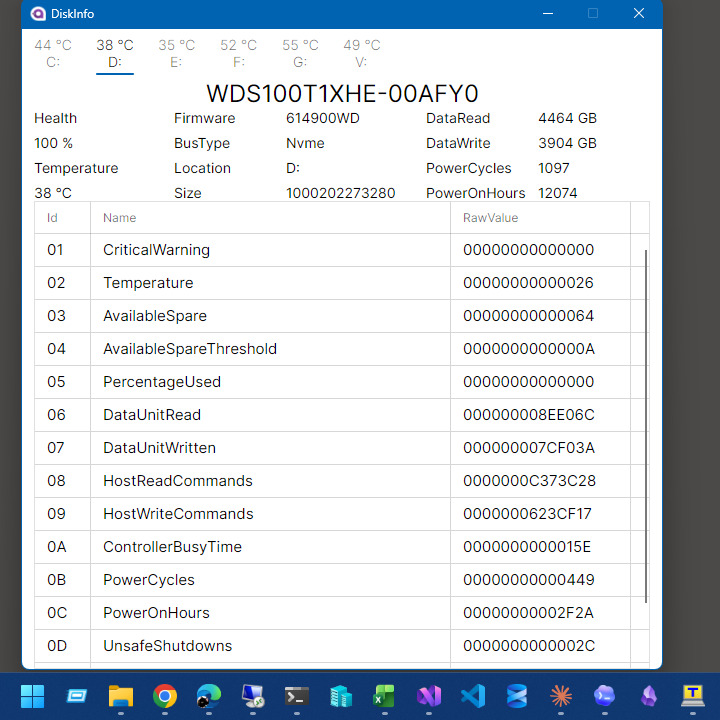
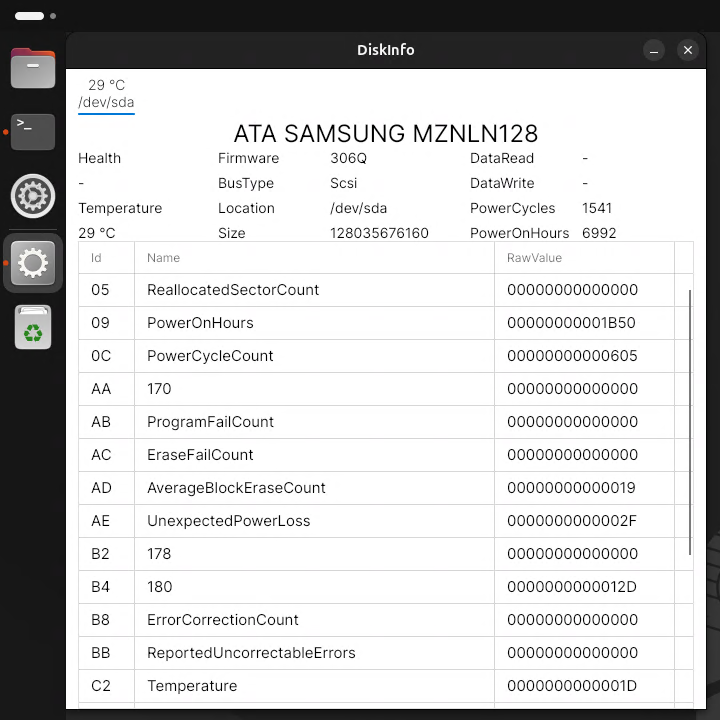
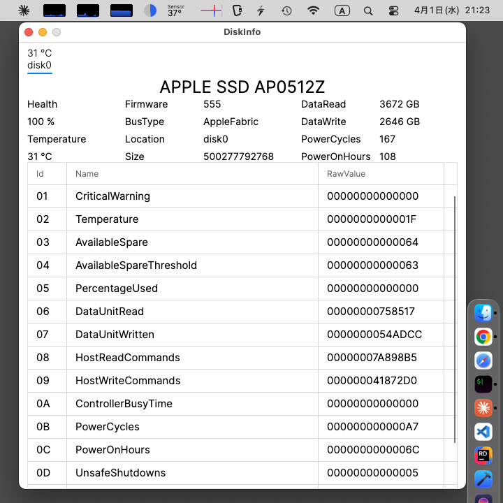

# Avalonia DiskInfo

Multi-platform S.M.A.R.T information display tool built with Avalonia UI.

## Reference

- [HaddwareInfo.Disk](https://github.com/usausa/hardwareinfo-disk)
- [LinuxDotNet.Disk](https://github.com/usausa/linux-dotnet)
- [MacDotNet.Disk](https://github.com/usausa/mac-dotnet)
- [Qiita article](https://qiita.com/yamaokunousausa/items/b34e4c937d68fc1f634c)
